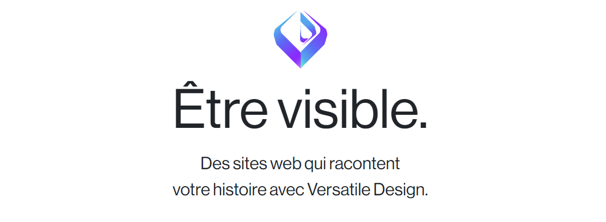

<div align="center">
  
</div>

<h1 align="center">Versatile Design</h1>
<h4 align="center">A web application for personalized website templates.</h4>

<p align="center">
  <a href="#introduction">Introduction</a> •
  <a href="#installation">Installation</a> •
  <a href="#usage">Usage</a> •
  <a href="#contributors">Contributors</a>
</p>

<div>
    
</div>

## Introduction
Versatile Design is a web application that empowers users to choose from a variety of website templates. The primary goal is to provide users with the flexibility to opt for personalized creations to suit their specific needs.

## Installation

1. Ensure that Django is installed on your machine. If not, you can install it with the following command:

   ```bash
   pip install Django
   ```

2. Clone the repository of the project into a directory of your choice:

   ```bash
   git clone https://github.com/Sirothpech/portfolio_vd.git
   ```

3. Navigate to the source folder (src) of the project:

   ```bash
   cd portfolio_vd/src
   ```

4. Install the necessary dependencies:

   ```bash
   pip install pillow
   pip install django-cors-headers
   ```

5. Run the Django development server:

   ```bash
   python manage.py runserver
   ```

6. Open your web browser and go to [http://localhost:8000/](http://localhost:8000/) to explore the application.

## Integrating Email Configuration

To enable email functionality in your Django project, you can follow these steps:

#### Install python-decouple
Run the following command to install the `python-decouple` library:

```bash
pip install python-decouple
```

#### Update settings.py
In your `settings.py` file, add the following configurations to enable email functionality. This example assumes you are using Gmail's SMTP server.

```python
# settings.py

from decouple import config

# Email Configuration
EMAIL_BACKEND = 'django.core.mail.backends.smtp.EmailBackend'
EMAIL_HOST = 'smtp.gmail.com'          # Gmail SMTP server address
EMAIL_PORT = 587                       # Port for Gmail SMTP server (TLS)
EMAIL_USE_TLS = True                    # Use TLS to secure the SMTP connection

# Gmail SMTP server credentials
EMAIL_HOST_USER = config('EMAIL_HOST_USER')
EMAIL_HOST_PASSWORD = config('EMAIL_HOST_PASSWORD')
```

Make sure to replace `EMAIL_HOST_USER` and `EMAIL_HOST_PASSWORD` with your Gmail email address and an [App Password](https://support.google.com/accounts/answer/185833?hl=en) or your account password if you have allowed less secure apps to access your account.

These configurations will enable your Django application to send emails using Gmail's SMTP server. After integrating this into your project, users will receive emails upon successful submission of a contact form.

### Secure Email Configuration with .env

To enhance security and avoid exposing sensitive information, follow these steps to use a `.env` file for your email credentials:

#### 1. Create a .env File
Create a file named `.env` in the root of your project and add the following content:

```env
# .env

EMAIL_HOST_USER="votreadressemail@gmail.com"
EMAIL_HOST_PASSWORD="5748 2590 6528 1100"
```

#### 2. Update .gitignore
Add `.env` to your `.gitignore` file to ensure that it is not pushed to your version control system:

```gitignore
# .gitignore

# Ignore .env file
.env
```

Now, your email credentials are securely stored in the `.env` file, and you can safely include this file in your `.gitignore`. This practice helps protect sensitive information from being exposed in your version control system.

## Usage

Once the server is running, access the application at [http://localhost:8000/](http://localhost:8000/) and start exploring the available features.

## Contributors

- [Chaherdine ABDOU](https://github.com/chaher13)
- [Christophe NGAN](https://github.com/Sirothpech)

© 2023 Versatile Design. All Rights Reserved.
